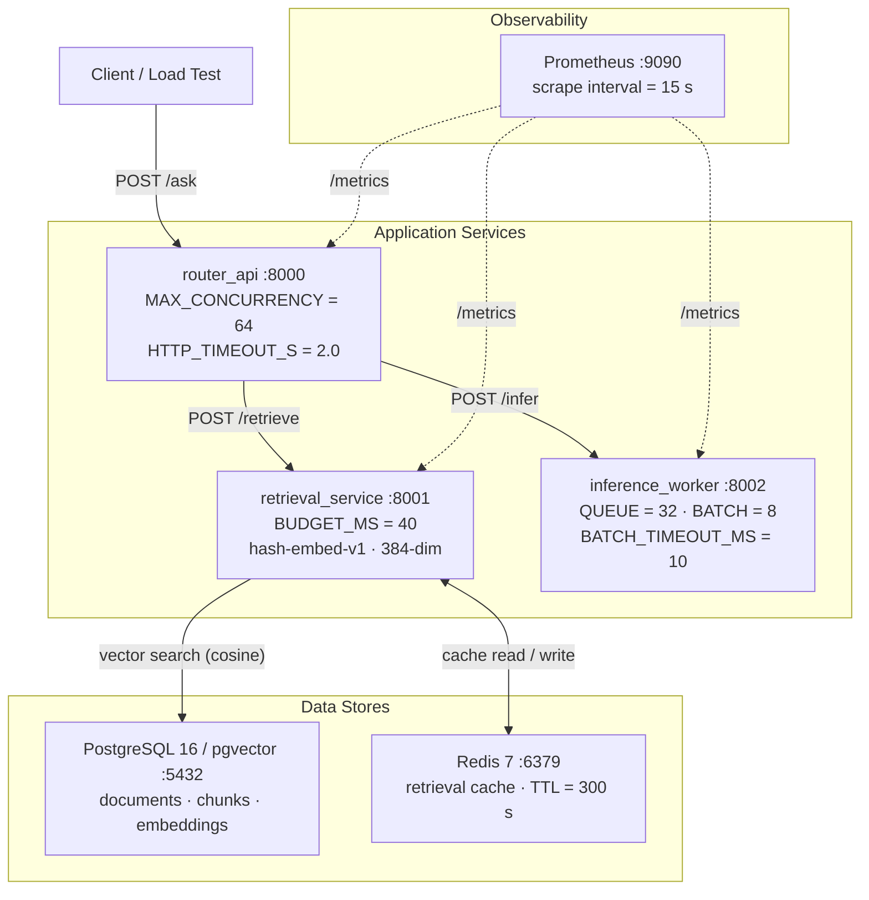
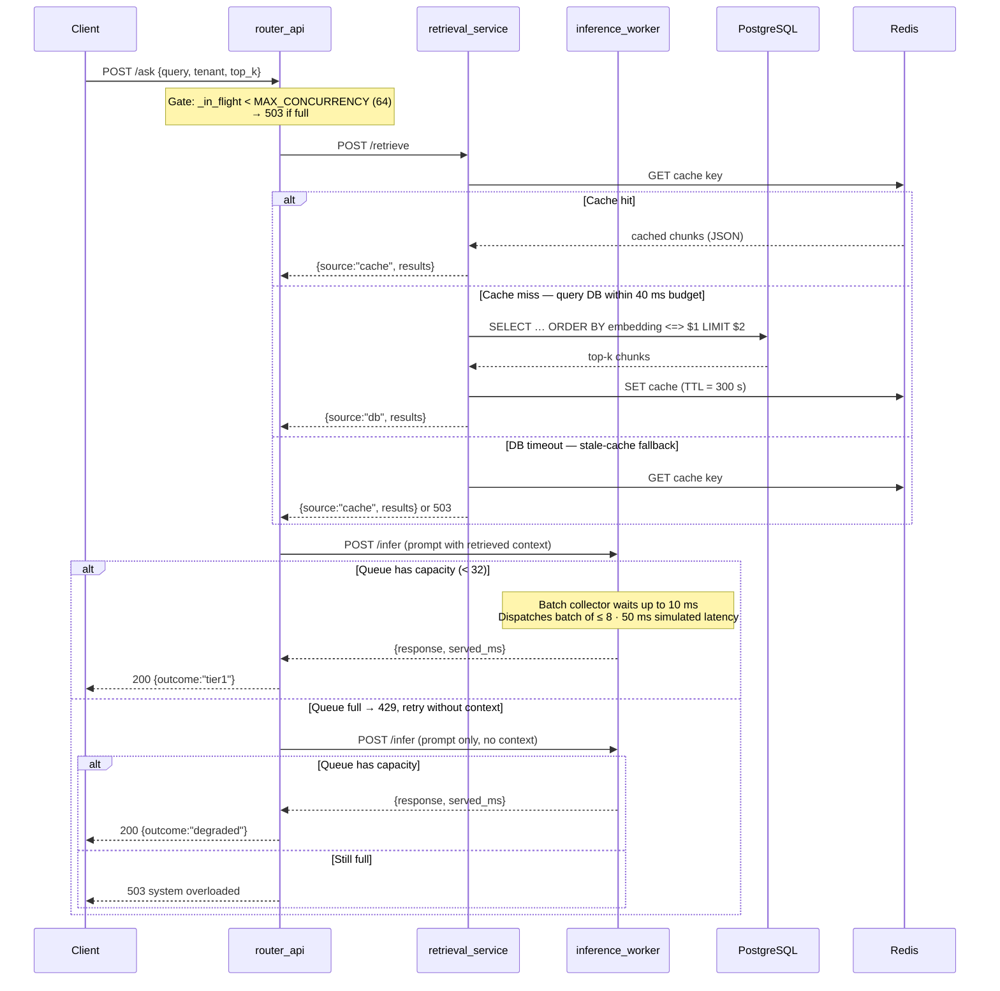
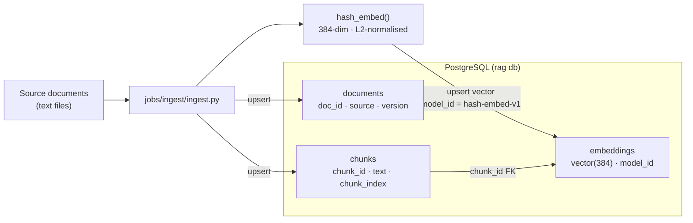

# ai-inference-platform-lab

This repository demonstrates a production-style AI inference platform skeleton designed to protect p95 latency under load through bounded concurrency, backpressure, dynamic batching, and degradation strategies. It is intentionally built as a systems-design lab rather than a feature demo.

## Architectural Goals

- Demonstrate SLO protection under load
- Model backpressure vs tail latency tradeoffs
- Implement bounded concurrency and degradation
- Separate retrieval, routing, and inference layers
- Instrument full-stack observability

### SLO Target

- Protect p95 latency under saturation
- Prefer fast-fail (429/503) over tail-latency inflation

> **Note:** Inference latency is simulated to isolate concurrency and backpressure behavior independent of model execution cost.

## What this repo demonstrates

- **RAG-style pipeline** — pgvector-backed retrieval and inference services wired end-to-end via `/ask`.
- **Microservice decomposition** — three independently deployable FastAPI services (router, retrieval, inference) communicate over HTTP, making each layer replaceable and scalable on its own.
- **Observability-first design** — Prometheus metrics exposed per service and scraped every 15 s.

## Architecture at a glance

| Container | Role |
|---|---|
| `router_api` | Admission control + orchestration (`/ask` in Milestone 4) |
| `retrieval_service` | pgvector top-k retrieval with latency budget + cache fallback |
| `inference_worker` | Queue cap + dynamic batching + simulated inference latency |
| `postgres` (pgvector) | Document / chunk / embedding store |
| `redis` | Retrieval cache + semantic cache (Milestone 2+) |
| `prometheus` | Scrapes metrics from all three services every 15 s |

### System topology



### Request flow — `/ask` and the degradation ladder



### Ingest pipeline (offline)



## Milestones

| | |
|---|---|
| ✅ Milestone 0 | Scaffold + metrics |
| ✅ Milestone 1 | Schema + ingestion + retrieval top-k |
| ✅ Milestone 2 | Retrieval latency budget + cache fallback |
| ✅ Milestone 3 | Inference queue + batching |
| ✅ Milestone 4 | `/ask` end-to-end + degradation ladder |
| ✅ Milestone 5 | Load test + p95 results |

## How to run

```bash
docker compose up --build
```

All six containers start together. On first run Docker builds the three application images and pulls the data-store images; subsequent starts are faster.

> **Note:** Credentials in `docker-compose.yml` are demo-only and intended for local development. Real deployments should inject secrets via environment variables or a secret manager.

To stop and remove containers (data volumes are preserved):

```bash
docker compose down
```

## Local dev

```bash
# Rebuild and restart a single service
docker compose up --build router_api

# Tail logs for one service
docker compose logs -f router_api

# Reset all data (wipes postgres, redis, prometheus volumes)
docker compose down -v
```

## Endpoints

| Service | URL | Description |
|---|---|---|
| router_api | http://localhost:8000/health | Health check |
| router_api | http://localhost:8000/metrics | Prometheus metrics |
| router_api | http://localhost:8000/docs | OpenAPI UI |
| retrieval_service | http://localhost:8001/health | Health check |
| retrieval_service | http://localhost:8001/metrics | Prometheus metrics |
| retrieval_service | http://localhost:8001/docs | OpenAPI UI |
| inference_worker | http://localhost:8002/health | Health check |
| inference_worker | http://localhost:8002/metrics | Prometheus metrics |
| inference_worker | http://localhost:8002/docs | OpenAPI UI |
| Prometheus | http://localhost:9090 | Metrics dashboard |
| PostgreSQL | localhost:5432 | DB `rag`, user `rag`, pass `rag` |
| Redis | localhost:6379 | Default database 0 |

> Demo credentials are intentionally non-secret and for local use only.

## Load test (Milestone 5)

Script: `scripts/load_test/run.py` — async httpx, configurable workers/duration/RPS.

```bash
# Install dependency (one-time)
python3 -m venv /tmp/lt_venv && /tmp/lt_venv/bin/pip install httpx==0.28.1 -q

# Default run: 20 workers, 30 seconds, unlimited RPS
/tmp/lt_venv/bin/python3 scripts/load_test/run.py

# Throttled: 50 RPS cap
/tmp/lt_venv/bin/python3 scripts/load_test/run.py --rps 50
```

### Baseline results (20 workers, 30 s, default docker-compose config)

| Metric | Value |
|---|---|
| Throughput | **134.9 req/s** |
| p50 latency | 150.8 ms |
| p90 latency | 205.6 ms |
| p95 latency | **253.3 ms** |
| p99 latency | 319.6 ms |
| max latency | 446.4 ms |
| 200 OK | 100 % (4 046 / 4 046) |
| outcome: tier1 | 89.5 % |
| outcome: degraded | 10.5 % |
| 503 / errors | 0 |

Degraded responses occur intentionally when the retrieval latency budget expires, allowing the system to preserve end-to-end responsiveness under load.

Under higher load (≥ 200 concurrent users), queue saturation produces visible rejection (429/503) rather than unbounded latency growth, enforcing the declared SLO policy.
