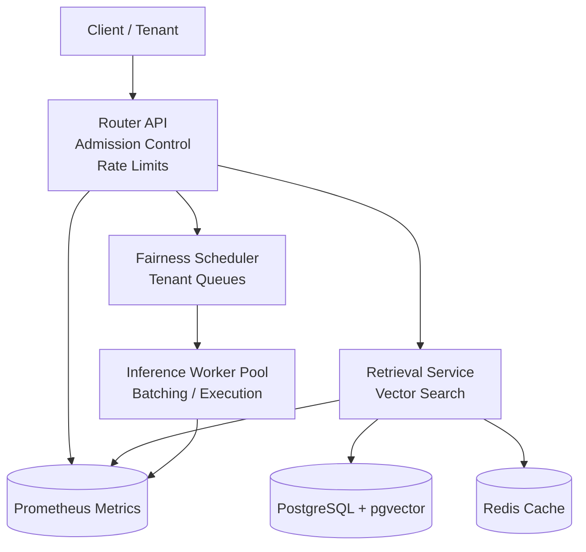
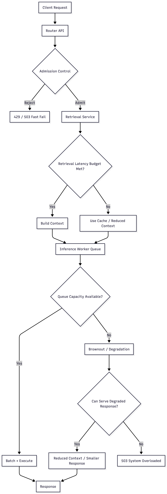

# AI Inference Platform Lab

This repository explores the platform architecture required to operate large-scale AI inference systems reliably under burst traffic and multi-tenant workloads. The focus is on platform reliability mechanisms such as admission control, fairness scheduling, bounded queues, and latency protection rather than model development.

The project models the control-plane mechanisms required to operate a multi-tenant inference platform reliably under unpredictable workloads.

---

## Purpose

Modern AI applications rely on large language model inference services that must serve highly variable requests while maintaining predictable latency.

Unlike traditional web services, inference workloads vary widely depending on prompt size, context retrieval, and generation length.

This lab focuses on **platform-level architecture mechanisms** used to maintain system stability and predictable latency under burst traffic.

---

## Why This Project Matters

Large inference systems face several operational challenges:
- protecting latency SLOs under burst traffic
- isolating tenants to prevent noisy-neighbor effects
- handling variable request cost
- maintaining predictable system behavior under overload

This repository demonstrates architectural mechanisms used in real inference platforms to address these challenges.

---

## Architectural Goals

The platform is designed to achieve the following objectives:

- maintain predictable latency under burst traffic conditions
- isolate tenants through fairness scheduling
- prevent latency collapse using bounded queues
- degrade gracefully when inference capacity is saturated
- expose internal system behavior through observability metrics

---

## System Properties

The platform is designed around the following operational properties:


| Property                      | Description                                                                 |
|------------------------------|-----------------------------------------------------------------------------|
| Latency Protection           | Admission control and bounded queues prevent latency collapse during bursts |
| Fairness                     | Tenant-aware scheduling ensures one tenant cannot starve others            |
| Predictable Overload Behavior| The system sheds excess traffic instead of buffering requests indefinitely |
| Graceful Degradation         | Retrieval budgets and generation limits can be reduced under load          |
| Observability                | Metrics expose queue depth, rejection rate, and latency distributions      |

---
### SLO Target

The system models a platform designed to protect latency targets such as:


|   **Metric**         | **Target**                      |
| ---------------- | -------------------------------- |
|   p95 latency    | < target threshold                   |
|   queue depth    | bounded                          |
|   failure mode   | fast fail or degraded response   |


The architecture prioritizes **latency protection over maximum throughput**.

---

## What This Repository Demonstrates

This lab models several architectural mechanisms used in large-scale inference systems:
- distributed inference routing
- retrieval-augmented generation pipeline
- admission control at the platform boundary
- bounded queues and backpressure
- fairness scheduling across tenants
- graceful degradation under overload
- observability of platform behavior

The goal is to explore **platform reliability and behavior**, not model optimization.

---

## Architecture Overview

The platform simulates a distributed inference system composed of routing, retrieval, and inference layers.

Requests enter through a routing layer that enforces admission control, tenant isolation, and fairness policies before interacting with retrieval and inference services.

The architecture separates control-plane responsibilities (routing, scheduling, and admission control) from execution-plane components (retrieval and inference workers) to maintain predictable latency under burst traffic.The platform simulates a distributed inference system composed of routing, retrieval, and inference layers.

Requests enter through a routing layer that enforces admission control and fairness policies before interacting with retrieval and inference services.

---

## Architecture Diagram



---


## Failure & Backpressure Flow

The platform protects latency SLOs using admission control and bounded queues.

<p align="center">
  
</p>

---

## Key Platform Mechanisms

The architecture implements several core platform mechanisms to protect latency and ensure predictable system behavior under burst traffic:

- **Admission control** – deadline-aware request admission to protect latency SLOs  
- **Fairness scheduling** – tenant-aware request queues to prevent noisy-neighbor effects  
- **Bounded queues** – controlled queue sizes to avoid latency collapse under overload  
- **Retrieval latency budgeting** – limiting retrieval work to preserve inference deadlines  
- **Inference batching** – grouping requests to improve worker throughput  
- **Graceful degradation** – reducing workload cost when capacity is constrained  
- **Observability** – system metrics exposing queue depth, latency, and rejection rates

---

## Load Testing Summary

The platform was load tested using **Locust** to simulate burst traffic scenarios.

Load tests evaluate:
- queue saturation behavior
- latency distribution under load
- admission control effectiveness
- degradation behavior during overload

Metrics were collected using **Prometheus**.

Example results:

| Scenario | Users | RPS | p95 Latency | Failure Rate |
| ----------------------- | ----- | --- | ----------- | ------------ |
| Baseline | X     | X   | X           | X            |
| Burst    | X     | X   | X           | X            |

---

## Architecture Documentation

A detailed architecture description is available in the repository: `docs/architecture/` [AI Inference Platform Architecture](docs/architecture/AI-Inference-Platform-Architecture-Description.md).

This document provides a TOGAF-style architecture description including:
- architecture principles
- application architecture
- data architecture
- technology architecture
- deployment model
- architecture tradeoffs

---

## Architecture Decisions

Key architectural decisions are documented as Architecture Decision Records (ADRs):

- [ADR 001 – Admission Control Strategy](docs/adr/001-admission-control.md)
- [ADR 002 – Bounded Queues](docs/adr/002-bounded-queues.md)
- [ADR 003 – Multi-Tenant Fairness Scheduling](docs/adr/003-fairness-scheduling.md)
- [ADR 004 – Graceful Degradation Strategy](docs/adr/004-degradation-strategy.md)

---

## Quick Start

Run the platform locally:

```bash
docker compose up --build
```

The system starts the router, retrieval service, inference worker, data stores, and metrics stack.

---

## Observability

Each service exposes metrics for system behavior analysis.

Metrics include:
- request latency
- queue depth
- admission rejection rate
- degradation events

Metrics are collected using **Prometheus**.

---


## Future Work

Potential extensions to this lab include:

- hierarchical fairness scheduling
- deadline-aware admission policies
- semantic caching layers
- GPU-backed inference workers
- multi-region inference routing
- advanced batching strategies

