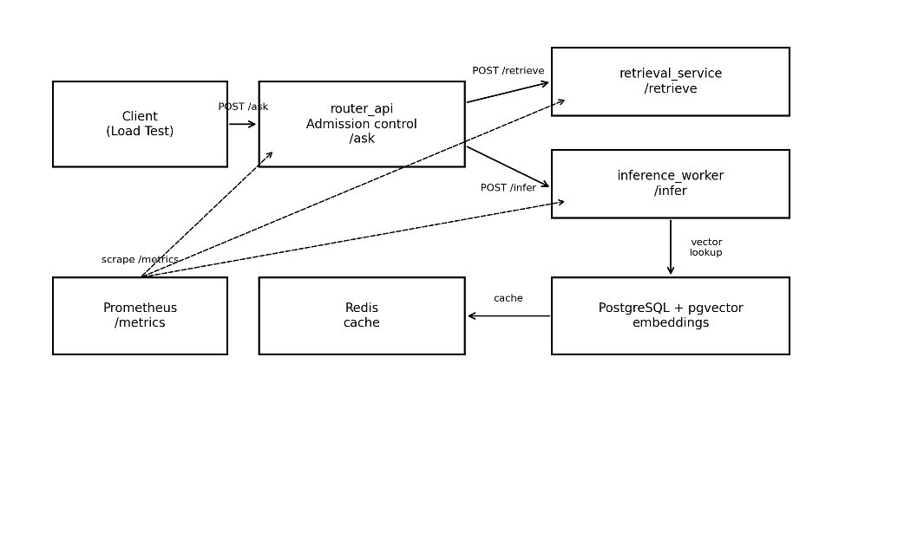

# AI Inference Platform Lab

## TOGAF-Style Architecture Definition

Version: 1.1  
Repository: CeciliaGit/ai-inference-platform-lab

## Table of Contents

- Executive Summary

- 1\. Architecture Vision

- 2\. Business Architecture

- 3\. Application Architecture

- 4\. Data Architecturea

- 5\. Technology Architecture

- 6\. Security and Compliance Architecture (Recommended)

- 7\. Architecture Building Blocks (ABB → SBB)

- 8\. Quality Attributes (NFRs) and SLOs

## Executive Summary

This document reviews the GitHub project “ai-inference-platform-lab” and frames it in a TOGAF-style architecture package. The project demonstrates a production-style inference + retrieval skeleton focused on protecting p95 latency under load via bounded concurrency, backpressure, dynamic batching, and degradation strategies. It is intentionally engineered as a systems-design lab rather than a feature demo.

## 1. Architecture Vision

### Problem Statement

LLM/AI inference systems often fail in the worst possible way under burst traffic: queueing builds up, tail latency explodes, and downstream services are overwhelmed. The goal of this lab is to show an architecture that makes overload visible, bounded, and operationally safe.

### Architecture Objectives

- Protect end-to-end p95 latency under saturation.

- Prefer explicit load shedding (429/503) over unbounded queue growth.

- Demonstrate backpressure controls at multiple layers (router concurrency gate + inference queue cap).

- Show how retrieval latency budgets and caching can preserve responsiveness.

- Provide end-to-end observability to validate behavior and support tuning.

### Scope and Assumptions

- Local, containerized environment using docker-compose.

- Inference latency is simulated to isolate concurrency and backpressure behaviors.

- No production-grade security controls (authn/z, mTLS, secrets management) are implemented; recommendations are included.

- Single instance per service (horizontal scaling patterns are discussed as extensions).

### High-Level Solution Concept

Logical component view (lab topology):

*Figure 1 — Logical components and interactions*

## 2. Business Architecture

### Stakeholders

| Stakeholder                          | Primary Concerns                                                            |
|--------------------------------------|-----------------------------------------------------------------------------|
| Platform Engineering / Core Platform | Owns reliability, scaling, and platform standards.                          |
| ML Engineering / Data Science        | Owns model lifecycle, prompt design, evaluation; needs predictable serving. |
| Product / Application Teams          | Consume inference APIs; require stable SLAs and guardrails.                 |
| SRE / Observability                  | Needs metrics, dashboards, alerting, and incident playbooks.                |
| Security / Risk / Compliance         | Requires data governance, audit trails, and privacy controls.               |

### Value Streams

**Serve an inference request:** Accept request → retrieve context → infer → return answer or fast-fail.

**Ingest and index knowledge:** Load docs → chunk → embed → store vectors → validate/refresh.

**Operate and tune the platform:** Measure → detect saturation → adjust knobs → verify p95 protection.

### Business Capabilities

Capability map (what the platform must be able to do):

| Capability                             | Notes                                                       |
|----------------------------------------|-------------------------------------------------------------|
| Traffic management & admission control | Rate limiting, concurrency gates, overload signaling.       |
| Retrieval (RAG)                        | Vector search, top-k retrieval, latency budgets, caching.   |
| Inference serving                      | Queueing, batching, scheduling, response shaping.           |
| Data ingestion & indexing              | Chunking, embeddings generation, upserts, re-index.         |
| Observability & SLO management         | Metrics, dashboards, alerts, load tests, tuning.            |
| Governance & policy (recommended)      | Tenant isolation, audit logs, PII controls, model approval. |

## 3. Application Architecture

### Services and Responsibilities

| Component         | Responsibility                                                                                                                         |
|-------------------|----------------------------------------------------------------------------------------------------------------------------------------|
| router_api        | Public entrypoint. Enforces MAX_CONCURRENCY gate. Orchestrates retrieval + inference. Implements degradation ladder. Exposes metrics.  |
| retrieval_service | Performs pgvector similarity search with time budget. Uses Redis cache to reduce DB load and to serve stale responses when DB is slow. |
| inference_worker  | Implements bounded queue and dynamic batching (MAX_QUEUE_SIZE, MAX_BATCH_SIZE, BATCH_TIMEOUT_MS). Returns 429 when saturated.          |
| ingest job        | Offline pipeline that reads source documents, chunks them, computes embeddings, and upserts into Postgres.                             |
| prometheus        | Scrapes /metrics endpoints to support SLO validation and tuning.                                                                       |

### API Surface (current)

- router_api: POST /ask, GET /health, GET /metrics

- retrieval_service: POST /retrieve, GET /health, GET /metrics

- inference_worker: POST /infer, GET /health, GET /metrics

### Key Interaction Patterns

**Admission control at the edge:** Router rejects quickly when in-flight requests exceed a threshold.

**Backpressure at the inference boundary:** Inference worker rejects when its bounded queue is full.

**Degradation ladder:** On inference rejection, retry once with smaller prompt (no context). On repeated rejection, fail fast.

**Latency budgeting:** Retrieval service attempts DB query within a strict budget; otherwise falls back to cache to preserve responsiveness.

## 4. Data Architecture

### Core Data Entities

The platform stores documents as chunks with an embedding per chunk (vector(384)).

*Figure 2 — Simplified relational model used for retrieval*

### Caching Strategy

The retrieval service uses Redis to cache retrieval results by tenant+query to reduce DB load and provide a fallback when the DB query cannot complete inside the latency budget.

## 5. Technology Architecture

### Runtime Stack

- Python 3.12 + FastAPI + Uvicorn (per service).

- PostgreSQL 16 + pgvector for vector similarity search.

- Redis 7 for caching.

- Prometheus for metrics collection.

- Docker Compose used for local orchestration (services are independently deployable).

### Operational Tooling (current)

Prometheus metrics are exposed via /metrics on each service to support SLO and tuning workflows.

## 6. Security and Compliance Architecture (Recommended)

The lab intentionally keeps security minimal. For an enterprise platform, the following controls are typically required:

- Authentication and authorization (mTLS + JWT/OAuth2, API keys, RBAC/ABAC).

- Tenant isolation and per-tenant quota / fairness scheduling.

- Secrets management (Vault/KMS/Secrets Manager) instead of demo credentials.

- PII/regulated-data controls: field-level access policies, redaction, logging controls.

- Audit logging of prompt, retrieval attributes, model version, and policy decisions.

- Supply-chain hardening: image scanning, dependency scanning, SBOM, signed images.

## 7. Architecture Building Blocks (ABB → SBB)

A simplified mapping of logical building blocks (ABB) to implemented solution building blocks (SBB):

| Architecture Building Block (ABB) | Solution Building Block (SBB)                          |
|-----------------------------------|--------------------------------------------------------|
| Edge router / API façade          | router_api (FastAPI), httpx client, Prometheus metrics |
| Retrieval engine                  | retrieval_service + asyncpg, pgvector SQL, Redis cache |
| Inference serving engine          | inference_worker + asyncio queue + dynamic batching    |
| Vector store                      | PostgreSQL 16 + pgvector + IVFFLAT index (optional)    |
| Cache                             | Redis 7                                                |
| Observability                     | Prometheus + /metrics per service                      |
| Load & performance testing        | Locust + async httpx script                            |

## 8. Quality Attributes (NFRs) and SLOs

Primary non-functional requirements demonstrated by this lab:

| Quality Attribute | How addressed                                                                              |
|-------------------|--------------------------------------------------------------------------------------------|
| Latency           | Protect p95 by shedding load early and bounding queues.                                    |
| Throughput        | Increase effective throughput via dynamic batching (GPU-style pattern).                    |
| Resilience        | Degradation ladder and time budgets prevent cascading failures.                            |
| Observability     | Metrics enable SLO measurement and tuning.                                                 |
| Maintainability   | Service decomposition keeps components replaceable (swap retrieval or inference backends). |
