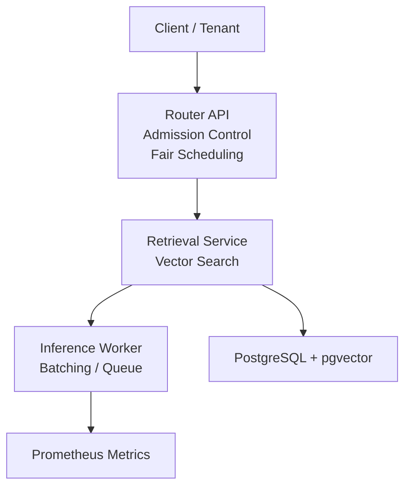
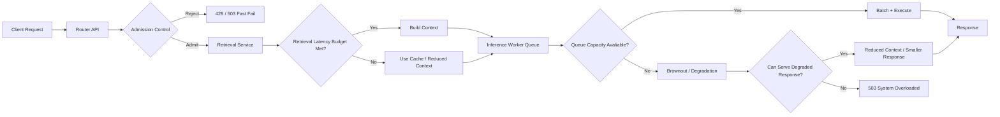
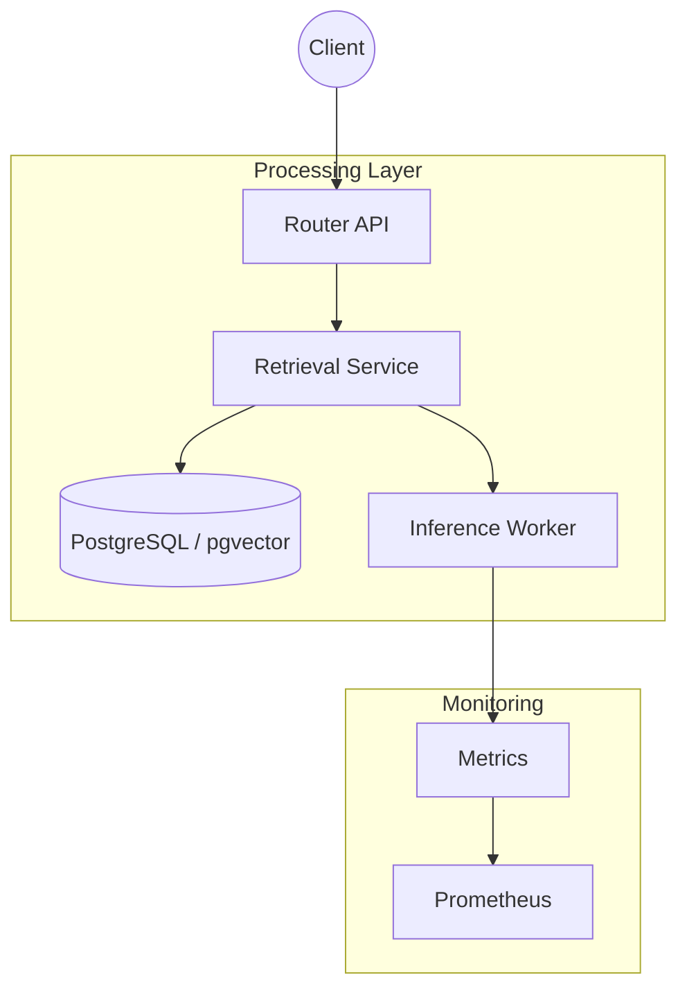
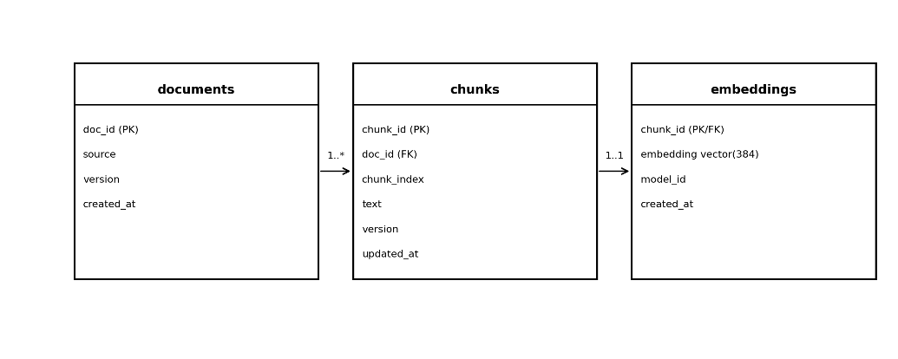
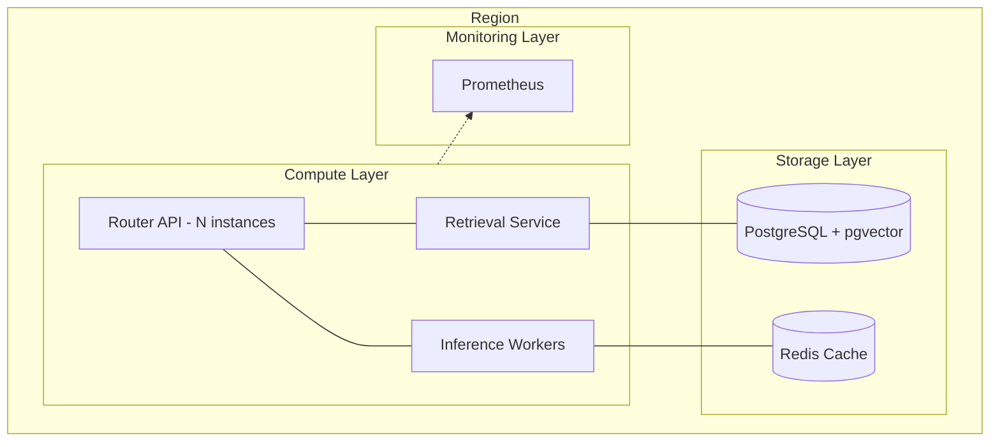

# AI Inference Platform – Architecture Description

- Architecture Style: Distributed Platform Architecture
- Primary Quality Attribute: Latency Predictability

## 1. Architecture Vision

Modern AI applications rely on large language model inference services that must serve highly variable requests while maintaining predictable latency and system stability. Unlike traditional web services, inference workloads vary significantly in computational cost due to differences in prompt size, context retrieval, and generation length.

This architecture models a distributed inference platform designed to maintain latency Service Level Objectives (SLOs) under burst traffic conditions while supporting multi-tenant workloads.

The platform focuses on control-plane mechanisms used in production inference systems, including:
- admission control to prevent overload
- bounded queues to protect latency SLOs
- tenant-aware fairness scheduling
- graceful degradation under resource pressure
- observability of system behavior under load

The goal of the lab is not to optimize model performance but to explore platform-level architectural mechanisms that enable reliable AI inference services.

---

## 2. Scope

The architecture models the platform components responsible for request routing, retrieval augmentation, inference execution, and system observability.

The system includes:
- an API routing layer responsible for admission control and request orchestration
- a retrieval service performing vector search over document embeddings
- an inference worker responsible for model execution and batching
- data stores supporting semantic retrieval and caching
- observability infrastructure used to monitor platform behavior

The architecture emphasizes platform reliability and predictable latency behavior rather than maximizing raw throughput.

---

## 3. Architectural Goals

The architecture is designed to achieve the following objectives:
- maintain predictable latency under burst traffic conditions
- isolate tenants to prevent noisy-neighbor effects
- enforce bounded request queues to prevent latency collapse
- degrade gracefully when inference capacity is saturated
- expose internal system behavior through observability metrics

---

## 4. Architecture Principles

The design follows several key principles:

- Latency protection over throughput
The platform prioritizes latency SLOs rather than maximizing request throughput.

- Bounded queues
Queues are intentionally bounded to prevent uncontrolled latency growth during traffic spikes.

- Admission control
Requests are rejected early when system capacity is exceeded rather than allowing requests to accumulate.

- Tenant isolation
Multi-tenant workloads are isolated through fairness scheduling to prevent resource starvation.

- Observability-first architecture
All services expose metrics enabling the platform to observe and evaluate system behavior.

## 5. Architecture Overview

### Problem Statement

LLM/AI inference systems often fail in the worst possible way under burst traffic: queueing builds up, tail latency explodes, and downstream services are overwhelmed. The goal of this lab is to show an architecture that makes overload visible, bounded, and operationally safe.

### High-Level Solution Concept

*Figure 1 — Architecture Overview Diagram*

## Failure & Backpressure Flow

The platform is designed to protect latency SLOs through admission control, bounded queues, and explicit degradation paths under overload.

## 6. Application Architecture

### Services and Responsibilities

| Component         | Responsibility                                                                                                                         |
|-------------------|----------------------------------------------------------------------------------------------------------------------------------------|
| router_api        | Public entrypoint. Enforces MAX_CONCURRENCY gate. Orchestrates retrieval + inference. Implements degradation ladder. Exposes metrics.  |
| retrieval_service | Performs pgvector similarity search with time budget. Uses Redis cache to reduce DB load and to serve stale responses when DB is slow. |
| inference_worker  | Implements bounded queue and dynamic batching (MAX_QUEUE_SIZE, MAX_BATCH_SIZE, BATCH_TIMEOUT_MS). Returns 429 when saturated.          |
| ingest job        | Offline pipeline that reads source documents, chunks them, computes embeddings, and upserts into Postgres.                             |
| prometheus        | Scrapes /metrics endpoints to support SLO validation and tuning.                                                                       |

### API Surface (current)

- router_api: POST /ask, GET /health, GET /metrics

- retrieval_service: POST /retrieve, GET /health, GET /metrics

- inference_worker: POST /infer, GET /health, GET /metrics

### Key Interaction Patterns

**Admission control at the edge:** Router rejects quickly when in-flight requests exceed a threshold.

**Backpressure at the inference boundary:** Inference worker rejects when its bounded queue is full.

**Degradation ladder:** On inference rejection, retry once with smaller prompt (no context). On repeated rejection, fail fast.

**Latency budgeting:** Retrieval service attempts DB query within a strict budget; otherwise falls back to cache to preserve responsiveness.

### System Diagram

*Figure 2 — Request Flow Architecture Diagram*

## 7. Data Architecture

### Core Data Entities

The platform stores documents as chunks with an embedding per chunk (vector(384)).

*Figure 3 — Simplified relational model used for retrieval*

### Caching Strategy

The retrieval service uses Redis to cache retrieval results by tenant+query to reduce DB load and provide a fallback when the DB query cannot complete inside the latency budget.

## 8. Technology Architecture

### Runtime Stack

- Python 3.12 + FastAPI + Uvicorn (per service).

- PostgreSQL 16 + pgvector for vector similarity search.

- Redis 7 for caching.

- Prometheus for metrics collection.

- Docker Compose used for local orchestration (services are independently deployable).

### Operational Tooling (current)

Prometheus metrics are exposed via /metrics on each service to support SLO and tuning workflows.

## 9. Deployment Architecture

### Deployment Diagram (Regional View)

*Figure 4 — Deployment Diagram (Regional View)*

---
## Operational Architecture
---

## 10. Observability

Observability enables evaluation of queue depth, latency distribution, degradation events, and worker throughput under load.

---

## 11. Architecture Tradeoffs

## 12. Key Architecture Decisions

- Admission control
The router rejects requests when queue depth exceeds capacity.

- Bounded queues
Unbounded queues cause tail-latency amplification under burst traffic.

- Cache fallback
Retrieval requests may fall back to cached responses when latency budgets are exceeded.

- Dynamic batching
Inference workers batch requests to improve GPU efficiency.

## 13. Stakeholders and Concerns

- Platform engineers
Concern: system scalability and operational observability.

- Application developers
Concern: predictable inference latency and service reliability.

- System operators
Concern: failure modes, system degradation, and monitoring.

